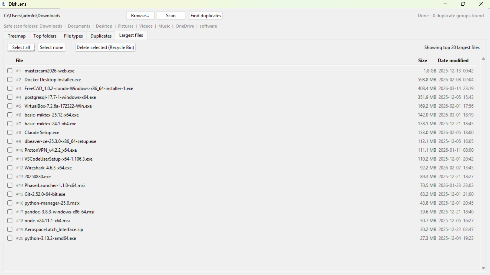

# 🔍 DiskLens

[](https://github.com/sunman97/disklens/actions)
[](https://github.com/sunman97/disklens/releases)
[](https://opensource.org/licenses/MIT)
[](https://www.python.org/downloads/)
[](#)

<p align="center">
  
</p>

**DiskLens** is a high-performance disk space analyzer and cleanup utility built with Python and Tkinter. It provides a visual deep-dive into your storage, allowing you to identify space-hogging folders, locate duplicate copies of files, and safely reclaim space by sending unwanted items to the system Recycle Bin.

---

## ✨ Features

*   **📊 Interactive Treemap**: Visualise your disk usage with nested rectangles (powered by `squarify`).
*   **📈 Resource Charts**: View top folders and distribution of file types via Matplotlib.
*   **👯 Duplicate Finder**: Locate redundant copies in the same directory using smart filename normalisation (e.g., matching `report (1).pdf` to `report.pdf`).
*   **🗑️ Safe Deletion**: Integrated with `send2trash` to move files to the Recycle Bin rather than permanent deletion.
*   **🛡️ Safety First**: Hardcoded "Safe Scan" areas and a robust blocklist to prevent accidental modification of system files.

---

## 🚀 Getting Started

### Prerequisites

*   **Python 3.10+** (Ensure Python is added to your PATH).
*   **Windows OS** (Primary platform for Windows-specific safety guards).

### Installation

1.  **Clone the repository**:
    ```bash
    git clone https://github.com/sunman97/disklens.git
    cd disklens
    ```

2.  **Install the package**:
    ```bash
    # It is recommended to use a virtual environment
    python -m venv .venv
    .venv\Scripts\activate
    pip install .
    ```

### Running DiskLens

After installation, you can launch the application:
```bash
python main.py
```
Or use the provided PowerShell helper:
```powershell
./run.ps1
```

---

## 🛠️ Development

We welcome contributions! Please see [CONTRIBUTING.md](CONTRIBUTING.md) for detailed setup instructions.

### Quick Start for Developers
```bash
# Install with dev dependencies
pip install -e .[dev]

# Run tests
pytest

# Lint and Format
ruff check . --fix
ruff format .
```

---

## 🛡️ Safety & Security

### Safe Scan Folders
DiskLens enforces a **"Safe Scan Area"** policy. By default, it will only allow scanning within specific user directories (e.g., `Downloads`, `Documents`, `Desktop`, `Pictures`, `software`). 

**Note for Developers/Power Users**:
If you need to scan custom locations, these must be added to the `_safe_roots()` function in `main.py` on a per-user basis.

### Blocklist & Guards
The scanner includes a hardcoded blocklist of system-critical paths like `C:\Windows` and `C:\ProgramData\Microsoft`. Reparse points (symbolic links and junctions) are never followed to prevent infinite loops.

For security vulnerabilities, please see our [Security Policy](SECURITY.md).

---

## 🏗️ Technical Architecture

- **Multi-threaded Scanner**: Parallel traversal using `ThreadPoolExecutor`.
- **Centralised Service Layer**: All file operations are isolated in `src/actions.py`.
- **Unified Styling**: Centralised theme management in `src/theme.py`.

---

## 📄 License

Distributed under the **MIT License**. See `LICENSE` for more information.
